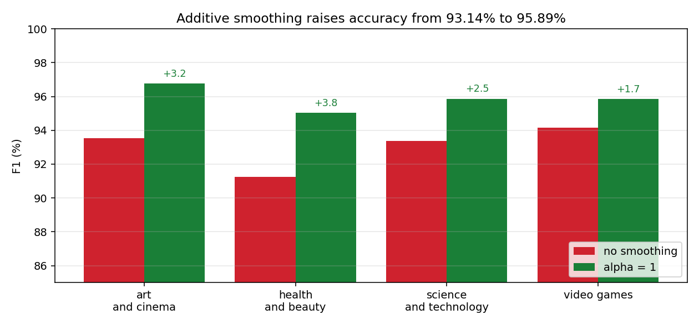

# Persian Article Classifier

Categorises Persian magazine articles by topic using a multinomial naive Bayes
classifier built from scratch: bag-of-words counts, additive smoothing, and log
probabilities. Four categories, covering art and cinema, health and beauty,
science and technology, and video games.



## Requirements

Python 3.10 or later. The classifier has no third-party dependencies; the figure needs matplotlib. The
optional `--hazm` flag needs [hazm](https://github.com/roshan-research/hazm) for
Persian normalisation and lemmatisation.

## Installation

```bash
pip install -e .
```

With hazm and the test suite:

```bash
pip install -e ".[persian,dev]"
```

## Usage

```bash
python -m naive_bayes.cli --train data/train.csv --test data/test.csv
```

Both CSVs need a `content` column of article text and a `label` column of
category. `data/test.csv` holds the 801-article evaluation set; the training
corpus is not redistributed here, so supply your own `data/train.csv` in the same
format. `data/punctuation.txt` is a punctuation list usable with `--stop-words`.

Useful flags:

| flag | effect |
| --- | --- |
| `--alpha` | Smoothing pseudo-count. `0` disables smoothing entirely |
| `--hazm` | Tokenise and lemmatise with hazm instead of the built-in splitter |
| `--stop-words` | Path to a stop word list, one per line |
| `--top-tokens N` | Also print the N most frequent tokens in each category |

Redraw the figure above from the recorded scores:

```python
from pathlib import Path
from naive_bayes.figures import smoothing_comparison

smoothing_comparison(Path("results/recorded_metrics.json"), Path("docs/smoothing.png"))
```

## Results

| | accuracy | macro F1 |
| --- | --- | --- |
| without smoothing | 93.14% | 93.07% |
| additive smoothing, alpha = 1 | 95.89% | 95.88% |

Smoothing is worth 2.75 points of accuracy here, and the reason is structural
rather than incidental. Class scores are sums of log probabilities, so a single
token that never appeared in a class during training sends that class's score to
negative infinity. One unseen word rules the class out no matter how strongly
every other word in the article points at it. A pseudo-count of one gives every
token in every class a small non-zero probability, which turns an absent word
into weak evidence instead of a veto.

Per class, with smoothing:

| category | precision | recall | F1 |
| --- | --- | --- | --- |
| art and cinema | 95.35% | 98.20% | 96.76% |
| health and beauty | 95.03% | 95.03% | 95.03% |
| science and technology | 95.36% | 96.39% | 95.87% |
| video games | 97.88% | 93.91% | 95.85% |

Every category gains, and the largest gain lands where the classifier was
weakest: health and beauty rises 3.8 points of F1, art and cinema 3.2. The full
scores are in `results/recorded_metrics.json`.

## Method

**Tokenising.** Lemmatisation rather than stemming, because Persian verbs carry
tense in affixes and a stemmer truncates those into strings that are not words.
Stop words and the zero-width non-joiner are stripped, along with bare digits and
single characters.

**Scoring.** For each class, the log prior plus the sum of smoothed log
likelihoods over the tokens present in the vocabulary. The evidence term is
identical across classes for a given document, so it cannot change the ranking
and is not computed. Tokens absent from the vocabulary are skipped rather than
penalised, since an unknown word says nothing about which class an article
belongs to.

**Evaluating.** Precision and recall are reported per class and neither is
sufficient alone: a model reaches perfect recall by predicting one class for
everything, and high precision by predicting it almost never. Macro averaging
gives a rare class the same weight as a common one; weighted averaging does not.
For single-label classification the micro average collapses to accuracy, since
every error is simultaneously one false positive and one false negative.

## Project structure

```
naive_bayes/
    preprocessing.py  tokenising, stop words, cleaning
    model.py          the classifier: fitting, smoothing, scoring
    metrics.py        per-class and averaged scores
    cli.py            corpus loading and command dispatch
    figures.py        the smoothing comparison chart
tests/                tokenising, fitting, smoothing and metric tests
data/                 evaluation corpus and a punctuation list
docs/                 figures referenced by this README
results/              recorded scores behind the tables above
pyproject.toml        dependencies and optional extras
```

## Components

| module | responsibility |
| --- | --- |
| `preprocessing` | Text to tokens, with an optional Persian NLP backend |
| `model` | Counts, priors, smoothed likelihoods, prediction |
| `metrics` | Precision, recall, F1, and the three averaging modes |
| `cli` | Reads the corpus, runs the pipeline, prints the report |
| `figures` | Draws the comparison chart from recorded scores |

## Testing

```bash
python -m pytest tests/
```

Fifteen tests covering tokenising, cleaning, fitting, smoothing behaviour at
alpha zero and one, unknown-token handling, and every metric including the case
where macro and weighted averages diverge. Nothing external is required.
